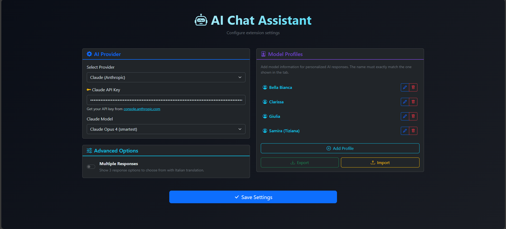
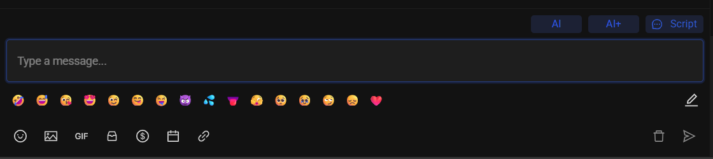

<div align="center">

# 🤖 AirChatter

**AI-powered chat assistant for OnlyFans creators**

Generate natural, human-like responses using Claude or ChatGPT

[](LICENSE)
[](https://www.google.com/chrome/)
[](https://www.anthropic.com/)
[](https://openai.com/)

[Features](#-features) • [Installation](#-installation) • [Usage](#-usage) • [Configuration](#-configuration) • [Privacy](#-privacy)

</div>

---

## ✨ Features

| Feature | Description |
|---------|-------------|
| 🎯 **Smart Responses** | Context-aware replies based on conversation history |
| 🔄 **Multi-Provider** | Switch between Claude and ChatGPT with one click |
| 👤 **Model Profiles** | Save creator info for personalized responses |
| 📝 **Triple Response** | Get 3 options: casual, flirty, and sales-oriented |
| 🌍 **Auto Language** | Detects fan's language and replies naturally |
| 🇮🇹 **Italian Translation** | Always shows Italian translation in multi-response mode |
| ⚡ **One-Click AI** | Inject responses directly into the chat textarea |

## 📸 Screenshots

<div align="center">

<p><em>Clean settings interface with two-column layout and dark theme</em></p>
</div>

<div align="center">

<p><em>AI and AI+ buttons seamlessly integrated next to the Script button</em></p>
</div>

## 🚀 Installation

### From Source

```bash
# Clone the repository
git clone https://github.com/0xDevDav/AirChatter.git
cd AirChatter
```

### Load in Chrome

1. Open `chrome://extensions/` in Chrome
2. Enable **Developer mode** (top right toggle)
3. Click **Load unpacked**
4. Select the `chrome-extension` folder
5. Pin the extension for easy access

## 🎮 Usage

| Button | Action |
|--------|--------|
| `AI` | Quick response without model profile |
| `AI+` | Personalized response using saved profile |

When **Multiple Responses** is enabled, you'll see 3 options to choose from:
- 💬 **Casual** - Friendly, conversational tone
- 😏 **Flirty** - Playful and teasing
- 💰 **Sales** - Naturally promotes content

## ⚙️ Configuration

### API Keys

| Provider | Where to get |
|----------|--------------|
| Claude | [console.anthropic.com](https://console.anthropic.com/settings/keys) |
| OpenAI | [platform.openai.com](https://platform.openai.com/api-keys) |

### Model Profiles

Create detailed profiles for personalized responses:

```
📍 IDENTITY: Name, age, nationality
📸 PHYSICAL: Appearance details
💰 PRICE LIST: PPV, customs, sexting rates
🚫 LIMITS: What she doesn't do
✅ AVAILABLE: Kinks, fetishes, preferences
🎭 ROLEPLAY: Favorite scenarios
🗣️ LANGUAGES: Spoken languages
```

> 💡 **Tip:** Use the "Optimize with AI" button to automatically structure raw info

## 🏗️ Project Structure

```
AirChatter/
├── chrome-extension/
│   ├── manifest.json      # Extension config (MV3)
│   ├── background.js      # API calls & prompts
│   ├── content.js         # UI injection
│   ├── options.html       # Settings page
│   ├── options.js         # Settings logic
│   └── bootstrap.*        # UI framework
├── README.md
└── LICENSE
```

## 🛡️ Privacy

- ✅ API keys stored locally in Chrome sync storage
- ✅ No external servers - direct API calls only
- ✅ No tracking or analytics
- ✅ Conversation data sent only to your chosen AI provider
- ✅ Open source - audit the code yourself

## 🛠️ Tech Stack

- **Extension:** Chrome Manifest V3
- **UI:** Bootstrap 5.3 + Bootstrap Icons
- **AI:** Anthropic Claude API / OpenAI API
- **Storage:** Chrome Sync Storage

## 📄 License

This project is licensed under the MIT License - see the [LICENSE](LICENSE) file for details.

---

<div align="center">

**Made with ❤️ for content creators**

⭐ Star this repo if you find it useful!

</div>
